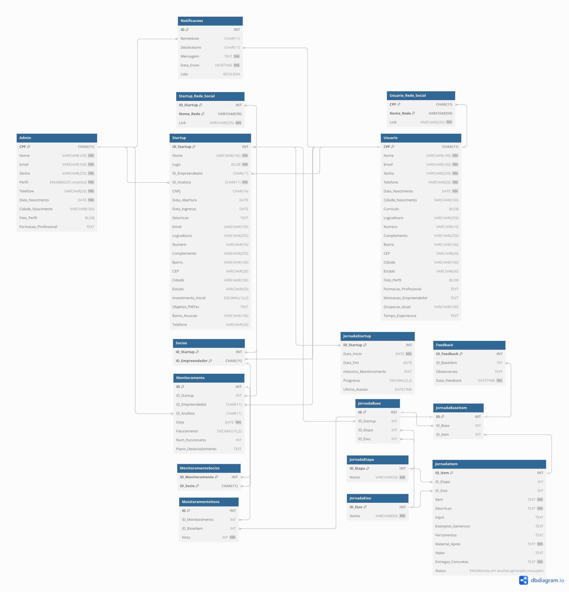

# SigBTec - Sistema de Gerenciamento da BTec

⚠️ Em Desenvolvimento!

## Requisitos do Ambiente

Para rodar o projeto localmente, certifique-se de ter a seguinte ferramenta instalada:

- Node.js >= 20.18.0
- MySQL >= 8.x ou outro banco de dados compatível

## Instalação

1. Clone o repositório:

```bash
git clone https://github.com/Maia-th/SigBTec.git
cd SigBTec
```

## Instale as dependências do projeto:

```bash
npm install
```

## Suba o banco de dados:

1. Crie o banco de dados:

```sql
CREATE DATABASE SigBTec;
```

2. Importe o esquema do banco de dados:

```bash
mysql -u seu_usuario -p SigBTec < path/para/seu/esquema.sql
```

Certifique-se de substituir `seu_usuario` pelo seu usuário do MySQL e `path/para/seu/esquema.sql` pelo caminho correto do arquivo de esquema.

## Configure o arquivo .env:

- Copie o arquivo `.env.example` e renomeie para `.env`
- Defina as variáveis de ambiente como o banco de dados, serviços de cache e outras integrações.

## Inicie o projeto:

```bash
npm start
```

## Banco de Dados



- [Link no dbdiagram.io](https://dbdiagram.io/d/Diagrama-ER-BTec-67578cb2e9daa85aca2ee511)
- [Dicionário de Dados](.github/docs/bancoDeDados.md)
