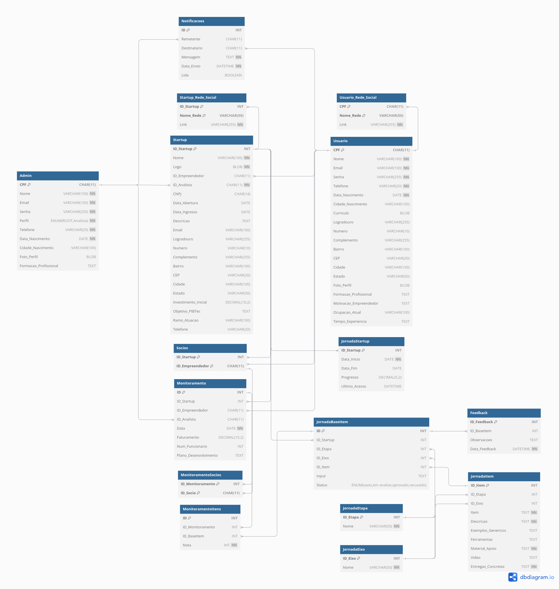

# SigBTec - Sistema de Gerenciamento da BTec

⚠️ Em Desenvolvimento!

## Requisitos do Ambiente

Para rodar o projeto localmente, certifique-se de ter a seguinte ferramenta instalada:

- Node.js >= 20.18.0
  
## Instalação

1. Clone o repositório:

```bash
git clone https://github.com/Maia-th/SigBTec.git
cd SigBTec
```

## Instale as dependências do projeto:

```bash
npm install
```
## Inicie o projeto:

```bash
npm start
```

## Banco de Dados



- [Link no dbdiagram.io](https://dbdiagram.io/d/6750d2f6e9daa85acab295d6)
- [Dicionário de Dados](.github/docs/bancoDeDados.md)